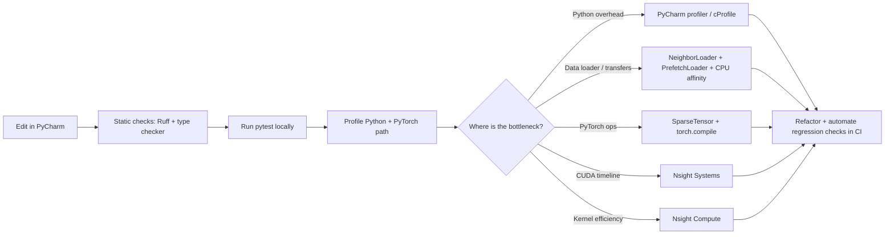

# PyCharm + PyTorch Geometric performance engineering

*A layered method: shorten the local loop in PyCharm, measure before guessing, fix data
loading and batching before kernel tuning, and only escalate to Nsight when the evidence
says you're bottlenecked below Python.*

> **Verification status.** This package's **CPU** paths were run and verified on the
> author's host (aarch64 Linux, no GPU). The **GPU/CUDA/Nsight** paths are authored from
> the official docs and the research brief and are **runnable on a CUDA host but not yet
> verified here** — every such section is marked *(GPU — verify on a CUDA host)*. Nothing
> is claimed as measured that was not actually run.

## The workflow (Mermaid)



## The five common PyG slowdowns (fix in this order)

1. **Data loading can't keep the GPU fed** → mini-batch with `NeighborLoader`; overlap
   host→device copies with `PrefetchLoader`; set CPU affinity / `num_workers`.
2. **Mini-batches explode in size** under neighbor sampling → cap fan-out
   (`num_neighbors`), use dynamic/size-based batching.
3. **Message passing is memory-hungry gather-scatter** where sparse matmul would do →
   `SparseTensor` / sparse adjacency.
4. **CUDA memory fragmentation / allocator churn** → `PYTORCH_CUDA_ALLOC_CONF`, memory
   snapshots.
5. **Graph breaks defeat `torch.compile`** → `torch.compile(model, dynamic=True)` and
   check for recompiles.

## What this package gives you

| Artifact | What it does | Verified |
|----------|--------------|----------|
| `scripts/profile_step.py` | `torch.profiler` over training steps → key-averages table + Chrome trace | CPU ✓ · GPU *(verify on CUDA host)* |
| `scripts/bench_loader.py` | full-batch vs `NeighborLoader` vs `PrefetchLoader` timings (ms) | CPU ✓ (loader) · GPU *(PrefetchLoader — verify)* |
| `src/pyg_perf/timing.py` | correct timing with CUDA sync (no async mis-measure) | CPU ✓ |
| `src/pyg_perf/config.py` | honest device resolution (asks cuda, reports fallback) | CPU ✓ |
| `.idea/runConfigurations/` | one-click PyCharm run configs | authored |
| `external_tools/{nsys,ncu}.sh` | Nsight Systems / Compute wrappers | *(GPU — verify on CUDA host)* |
| `.github/workflows/ci.yml`, `.gitlab-ci.yml` | CPU matrix + documented self-hosted GPU job | CPU CI ✓ |

## Running it

```bash
# 1) install torch for YOUR platform first (CPU or CUDA build) — see pytorch.org/get-started
pip install -e ".[bench]"

# 2) CPU (runs anywhere)
python scripts/bench_loader.py --device cpu --num-nodes 5000 --steps 15
python scripts/profile_step.py --device cpu --steps 12

# 3) GPU host (verify on your CUDA box)
python scripts/bench_loader.py --device cuda            # adds PrefetchLoader
python scripts/profile_step.py --device cuda --amp --compile
```

### Reading the output

- `bench_loader` prints ms per call for each loader strategy. Expect `neighbor_loader` to
  scale to graphs `full_batch` can't hold; on GPU, `prefetch_loader` should hide copy latency.
- `profile_step` prints the profiler's top ops by self-time and writes `trace_<device>.json`
  — open it in `chrome://tracing` or the PyCharm trace viewer.

## GPU knobs *(verify on a CUDA host)*

```bash
# Serialize kernel launches so tracebacks point at the real op (debug only — slower):
CUDA_LAUNCH_BLOCKING=1 python scripts/profile_step.py --device cuda

# Tame allocator fragmentation for spiky, variable-size neighbor batches:
PYTORCH_CUDA_ALLOC_CONF=max_split_size_mb:128 python scripts/bench_loader.py --device cuda
```

- **AMP:** `--amp` wraps the forward in `torch.autocast("cuda", float16)`. CUDA only;
  ignored on CPU (honestly — see `train_step`).
- **`torch.compile(dynamic=True)`:** `--compile`. `dynamic=True` because neighbor sampling
  makes batch shapes vary; watch for recompiles in the profiler.

## Nsight escalation *(GPU — verify on a CUDA host)*

Only after the PyTorch/PyG evidence says you're bottlenecked below Python:

```bash
external_tools/nsys.sh python scripts/profile_step.py --device cuda   # timeline: gaps, copies, sync
external_tools/ncu.sh  python scripts/profile_step.py --device cuda   # per-kernel efficiency
```

`nvprof` is legacy — use Nsight on modern CUDA toolchains.

## Sources

- torch.profiler — https://pytorch.org/docs/stable/profiler.html
- PyG NeighborLoader / PrefetchLoader —
  https://pytorch-geometric.readthedocs.io/en/latest/modules/loader.html
- torch.compile — https://pytorch.org/docs/stable/generated/torch.compile.html
- CUDA allocator (`PYTORCH_CUDA_ALLOC_CONF`) —
  https://pytorch.org/docs/stable/notes/cuda.html#memory-management
- Nsight Systems / Compute — https://developer.nvidia.com/nsight-systems ·
  https://developer.nvidia.com/nsight-compute

## Caveats / limitations

- **No GPU on the author's host** — GPU paths are authored, not yet measured here.
- Synthetic random graphs are for *pipeline* timing, not accuracy or real-graph structure.
- `torch.compile` gains are workload-dependent and can regress with frequent recompiles.
